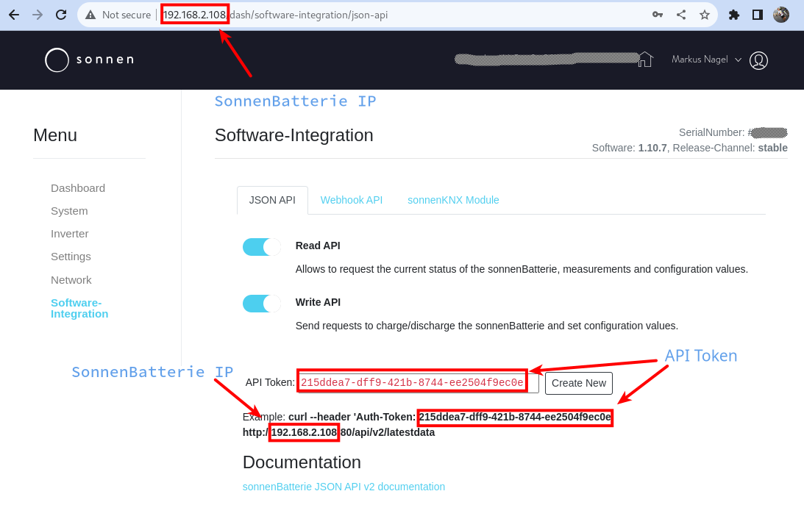

# Scripts

## autoload.sh

#### Use case
_If you want to charge your battery with a given power setting (Watts) and up to a certain state of charge (SoC) - regardless of actual PV surplus - e.g. with a dynamic (hourly) tariff, such as Tibber, et.al._

### What is it?

A bash shell script, using `curl` and `jq` (if you don't have either of those in your distro, you should install them before using the script).

It calls the SonnenBatterie's internal API to charge it (regardless where the power comes from, so in most cases that will be the grid).

It needs the SonnenBatterie's IP Address (NOT the SonnenCloud, it directly calls the SonnenBatterie) and the API Token (that you can find on the "Software Integration" page of your SB)



### Setup

You can set the IP and Token via environment variables:

`SONNEN_API_IP`  
`SONNEN_API_TOKEN`

or you can pass them in via command line.

### Usage

`./autoload.sh -w watts -p percentage [-i IP address] [-t sonnen API token]`

Watts (`-w`) and percentage (`-p`) are mandatory values, `-i` and `-t` for the IP and Token are optional parameters, but need to be set, either via environment or via command line.

Example: 

```
[🎩︎mnagel SonnenBatterie]$ ./autoload.sh -w 4000 -p 40  
[2023-11-06 15:37:28]  Current SoC: 0% - Starting to charge with 4000 Watts up to 40 %
[/] Desired SoC:  40 %, current SoC 14 % -- current charge power -4001 Watts
```


