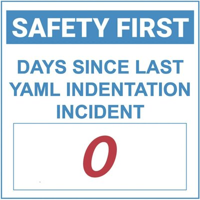

# Scripts

## evcc.io Sonnenbatterie discharge control

A common problem for home battery users (especially with AC-connected batteries that don't have a tight integration with an inverter or Wallbox/Charger) is that any consumption that exceeds the PV production will be supported by the battery. As a result - whenever you charge your car, the battery will be "sucked empty" (_imitate *slurping* noise here_) in no time.

The [evcc.io](https://evcc.io/) team is currently working on supporting especially hybrid inverters (with their attached batteries) but it might take a while until there is time to look into the Sonnenbatterie.

However, if you are an evcc user and have a Sonnenbatterie, there is a simple and straightforward solution:

evcc [supports messaging](https://docs.evcc.io/docs/reference/configuration/messaging) - you can send messages to your IM Provider of choice, triggered by evcc events. As an additional feature, you can configure a script as "messaging provider", if you will.

So, what we can do is: 

1) Configure evcc to use a script for messaging and configure the start/stop events in the `evcc.yaml` configuration  
2) Use a script that then calls the Sonnenbatterie API:

    On event: Charging started - stop battery discharge  
    On event: Charging stopped - reset the battery to normal mode (self-consumption, where it will support any consumption, trying to avoid grid usage)

Simple as that.

This is based on the work that [GrimmiMeloni](https://github.com/GrimmiMeloni) did for his Tesla Powerwall - [take a look](https://github.com/GrimmiMeloni/powerwall-backupCtrl), it's awesome! 

> __I hereby summon the Power of Open Source__ *__bzzzt__* - he shared his work on GitHub, so I could learn from that and then adapted it to the Sonnenbatterie use case - which is simpler, but different. __Thank you!!__)

### Configuration

1) Download the `sb-control.sh` script [from here](./evcc/sb-control.sh) and store it on your Raspberry (whereever you run evcc) 
    > **Note**, this is a Linux shell script - I have only tested this on my Raspberry. If you are running evcc on a Windows VM, it won't work. If you run it on a Mac, it _might_ work. If you run evcc in a container, you should either include that script in your `dockerfile`, so it becomes part of your container image, or mount it in your container, so the script directory is accessible to evcc 

2) Whereever you store it - the evcc user needs to have access and it needs to be executable. So, issue the following Linux commands:
    ```
    chmod +rx /path/to/your/directory
    chmod +rx /path/to/your/directory/sb-control.sh

    ```
    This gives everyone (all users on your Raspberry, _not_ your cat, your dog, everyone on the Internet...) access to the directory where the script is as well as access to the script itself. 

3) Create a file `settings.env` in the same directory (or download / copy the values from [this one](./evcc/settings.env) as a template).  
    It needs to contain
    * SONNEN_API_IP=
    * SONNEN_API_TOKEN=

    You can get the API Token from the Dashboard of your Sonnenbatterie in your home network (NOT the "Sonnen Dashboard" on the Internet or the the Sonnen App). Also (just a note) the API Token is not connected to your Sonnen Account and unless someone has access to your home network, this is useless for anyone but yourself.

    > **NOTE**: Make sure to switch on "Read API" and "Write API" - otherwise the script can't control the battery. 

    

4) Add this section to your `evcc.yaml`:
    Make a backup of your `evcc.yaml` first, just in case you hit an error...  
      

```
messaging:
  events:
    start:
      title: charging_started
      msg: ${title} started charging in ${mode} mode
    stop:
      title: charging_stopped
      msg: ${title} finished charging with ${chargedEnergy:%.1fk}kWh in ${chargeDuration}
    connect:
      title: vehicle_connected
      msg: Car connected on wallbox ${title}
    disconnect:
      title: vehicle_disconnected
      msg: Car disconnected from ${title} after ${connectedDuration}
    soc:
      title: soc_changed
      msg: ${vehicleSoc}

  services:
  - type: script
    cmdline: /path/to/your/directory/sb-control.sh
    timeout: 30s
```  

> **Note** Only the `start` and `stop` events are currently being used, you can remove the others (`connect`, `disconnect` and `soc`) from your `evcc.yaml` - I just added them for future use. This way, I don't have to change the yaml and restart evcc if I want to handle other events.

5) Restart evcc  
If you have configured it as a systemd service (as I have) you can follow the [evcc documentation](https://docs.evcc.io/docs/installation/linux#systemdienst)

```
sudo systemctl restart evcc
```

6) Aaaaaand - you're done.


--------------------------------------------------------------------------------------------------------------------------------------------
--------------------------------------------------------------------------------------------------------------------------------------------
--------------------------------------------------------------------------------------------------------------------------------------------


## [autoload.sh](./misc/autoload.sh)

#### Use case
_If you want to charge your battery with a given power setting (Watts) and up to a certain state of charge (SoC) - regardless of actual PV surplus - e.g. with a dynamic (hourly) tariff, such as Tibber, et.al._

### What is it?

A bash shell script, using `curl` and `jq` (if you don't have either of those in your distro, you should install them before using the script).

It calls the SonnenBatterie's internal API to charge it (regardless where the power comes from, so in most cases that will be the grid).

It needs the SonnenBatterie's IP Address (NOT the SonnenCloud, it directly calls the SonnenBatterie) and the API Token (that you can find on the "Software Integration" page of your SB)


### Setup

You can set the IP and Token via environment variables:

`SONNEN_API_IP`  
`SONNEN_API_TOKEN`

or you can pass them in via command line.

### Usage

`./autoload.sh -w watts -p percentage [-i IP address] [-t sonnen API token]`

Watts (`-w`) and percentage (`-p`) are mandatory values, `-i` and `-t` for the IP and Token are optional parameters, but need to be set, either via environment or via command line.

Example: 

```
[🎩︎mnagel SonnenBatterie]$ ./autoload.sh -w 4000 -p 40  
[2023-11-06 15:37:28]  Current SoC: 0% - Starting to charge with 4000 Watts up to 40 %
[/] Desired SoC:  40 %, current SoC 14 % -- current charge power -4001 Watts
```


